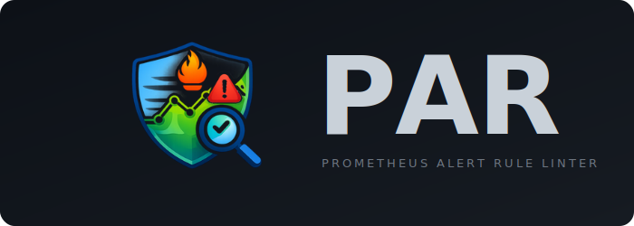
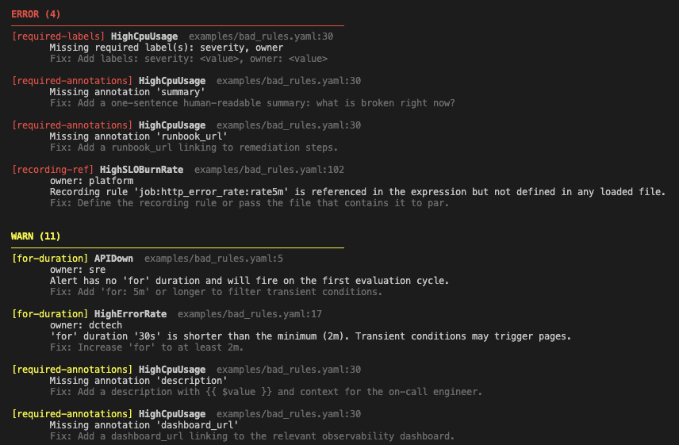

<p align="center">
  <a href="https://github.com/sadamchyk/par-linter/actions/workflows/ci.yaml"></a>
  <a href="https://www.python.org"></a>
  <a href="LICENSE"></a>
  <a href="https://docs.astral.sh/ruff/"></a>
</p>

<p align="center">
  
</p>

A static analysis tool for Prometheus alerting rule files. `par` catches quality issues that make alerts noisy, unreliable, or hard to act on during incidents.

## Why par?

[promtool](https://prometheus.io/docs/prometheus/latest/command-line/promtool/) validates syntax. `par` goes further — it checks whether your alerts will actually work well in production:

- Alerts that fire on transient blips (missing `for` duration)
- Missing metadata that leaves on-call without context
- Selectors too broad or too narrow
- PromQL patterns that are valid but operationally risky
- Broken recording-rule references and duplicate alerts

## Quick start

### Installation

```bash
git clone https://github.com/sadamchyk/par-linter.git
cd par-linter
make install
```

### Usage

```bash
par lint rules/*.yaml                       # lint rule files
par lint rules/ --format table              # table output
par lint rules/ --format json               # JSON for CI pipelines
par lint rules/ --min-severity warning      # filter by severity
par lint rules/ --config .par.yaml          # custom config
```

### Try it

```bash
make example    # runs par against the examples/ directory
```

## Example output

<p align="center">
  
</p>

## What it checks

| Check | Severity | What it catches |
|-------|----------|-----------------|
| `for-duration` | warning | Missing or too-short `for` clause |
| `absent-selector` | warning | `absent()` without label selectors |
| `rate-window` | warning | `rate()`/`irate()` window too short |
| `required-labels` | error | Missing labels like `severity`, `team` |
| `required-annotations` | error | Missing `summary`, `runbook_url`, etc. |
| `invalid-owner` | error | Owner not in configured allowlist |
| `broad-selector` | warning | No selectors or missing scoping labels |
| `no-comparison` | warning | Alert expression without comparison operator |
| `counter-threshold` | warning | Raw counter used as threshold |
| `non-base-unit` | info | Non-base unit suffix (milliseconds, percent) |
| `recording-ref` | error | Recording rule referenced but not defined |
| `duplicate-alert` | error | Duplicate alert name in same group |

## Configuration

Create `.par.yaml` in your repo root:

```yaml
required_labels:
  - severity
  - team

required_annotations:
  - summary
  - description
  - runbook_url

for_policy:
  min: 5m

selector_policy:
  require_one_of: [job, cluster, namespace, service]
```

## CI usage

```bash
# fail on errors, report warnings
par rules/*.yaml --min-severity warning

# JSON for downstream processing
par rules/*.yaml --format json

# SARIF for GitHub code scanning
par rules/*.yaml --format sarif > par.sarif
```

## Documentation

Full docs are available on [GitHub Pages](https://sadamchyk.github.io/par-linter/) or as [raw Markdown](docs/).

Check the [examples](examples/) dir for sample rule files.

## Contributing

```bash
make install-dev    # install with dev dependencies
make test           # run tests
make lint           # run ruff
```

## Key decisions and tradeoffs

**Python 3.9+ with a single dependency.**
Python is available everywhere, has great YAML support, and needs no compile step. The only external dependency is `pyyaml`. This keeps installation trivial and avoids version conflicts in CI environments.

**Regex-based PromQL analysis instead of a full parser.**
A proper PromQL parser would give us an AST to walk, but it adds a heavy dependency and limits Python version compatibility. Since we target specific patterns (selectors, `rate()` windows, `absent()`, counter names, comparison operators), regex extraction is sufficient. The tradeoff is that edge cases in deeply nested expressions may be missed — but for the patterns that matter in practice, it works well.

**Offline-only by default.**
`par` reads only the YAML files you give it — no Prometheus server connection required. This makes it safe for CI, fast to run, and easy to adopt. The tradeoff is that we can't validate whether selectors match real series or estimate alert fanout. Those would require a live instance and are left as future work.

**Configurable but opinionated defaults.**
The default config requires `severity` and `owner` labels, and `summary`, `description`, `runbook_url`, and `dashboard_url` annotations. Teams can override everything in `.par.yaml`, but the defaults reflect real-world incident response needs. The goal is that `par` is useful out of the box without any config file.

**Multiple output formats for different workflows.**
`par` supports text (human-readable), table (compact review), JSON (machine-readable for CI pipelines), and SARIF (GitHub Actions code scanning). Rather than forcing one format, each serves a different use case — developers read text, CI parses JSON, and GitHub annotations come from SARIF. This avoids building separate integrations for each platform.

**Label filtering for targeted analysis.**
The `--label KEY=VALUE` flag lets you scope a run to specific alerts — for example `--label team=sre` to lint only one team's rules. This is useful when different teams share the same rule files but have different quality bars, or when you want to focus CI feedback on the alerts you own.

**Per-owner summary for large rule sets.**
When you have hundreds of alerts across many teams, reading individual findings doesn't scale. The `par summary` command aggregates findings by `owner` label and shows a health status per team (CLEAN / WARNINGS / ISSUES). This lets platform teams quickly identify which owners need to fix their rules without digging through the full report.

## License

[MIT](LICENSE)
